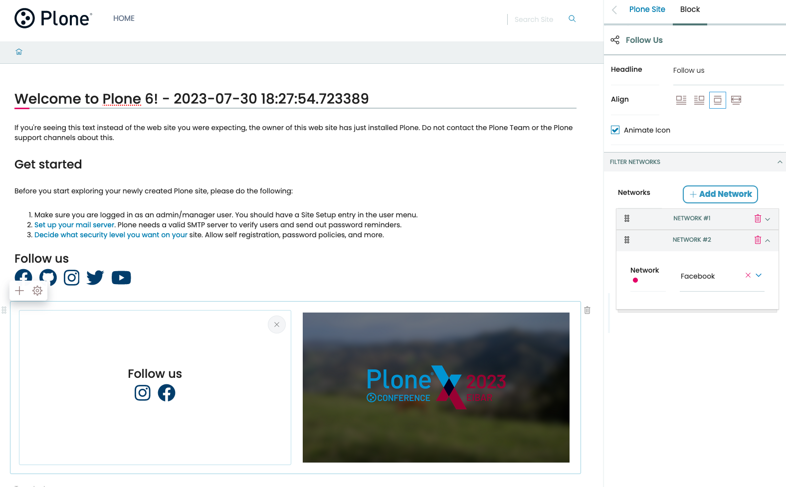

<h1 align="center">Volto Network Block (@plonegovbr/volto-network-block) </h1>

<div align="center">

[](https://www.npmjs.com/package/@plonegovbr/volto-network-block)
[](https://github.com/plonegovbr/volto-network-block/actions)
[](https://github.com/plonegovbr/volto-network-block/actions)
[](https://github.com/plonegovbr/volto-network-block/actions)

</div>

## About
The @plonegovbr/volto-network-block package provides components and blocks to connect your Volto site to existing social network profiles.

### Blocks

* **Follow Us**: Block with links pointing to social network profiles.

## Screenshots

### Follow Us Block



## Installation

### New Volto Project

Create a Volto project, install the new add-on and restart Volto:

```shell
yarn install
yarn start
```

### Existing Volto Project

If you already have a Volto project, just update `package.json`:

```JSON
"addons": [
    "@plonegovbr/volto-network-block"
],

"dependencies": {
    "@plonegovbr/volto-network-block": "*"
}
```


## Configuration

This addon is configured either via backend (the preferred way) or via the Volto registry in the frontend.

### Frontend codebase

On your Volto project configuration, update `config.settings` with a `socialNetworks` array:

```javascript
const applyConfig = (config) => {
  config.settings = {
    ...config.settings,
    socialNetworks: [
      {
        id: 'twitter',
        title: 'Twitter',
        icon: 'twitter',
        url: 'https://twitter.com/ploneorgbr/',
      },
      {
        id: 'instagram',
        title: 'Instagram',
        icon: 'instagram',
        url: 'https://www.instagram.com/plonebr/',
      },
    ],
  };
  return config;
};
```

Each entry in `socialNetworks` should have the following structure:

```javascript
{
    id: 'twitter',
    title: 'Twitter',
    icon: 'twitter',
    url: 'https://twitter.com/ploneorgbr/',
},
```

### Backend (via Generic Setup)

On your Python package, add (or edit) the `actions.xml` file on the default profile to add the networks:

```xml
<?xml version="1.0" encoding="utf-8"?>
<object xmlns:i18n="http://xml.zope.org/namespaces/i18n"
        meta_type="Plone Actions Tool"
        name="portal_actions"
>
  <object meta_type="CMF Action Category"
          name="social_actions"
  >
    <property name="title">Social actions</property>
    <object meta_type="CMF Action"
            name="facebook"
    >
      <property name="title"
      >Facebook</property>
      <property name="description"
      />
      <property name="url_expr">string:https://www.facebook.com/Plone-Brasil-101606785972720</property>
      <property name="link_target" />
      <property name="icon_expr">string:facebook</property>
      <property name="available_expr" />
      <property name="permissions">
        <element value="View" />
      </property>
      <property name="visible">True</property>
    </object>
    <object meta_type="CMF Action"
            name="github"
    >
      <property name="title"
      >GitHub</property>
      <property name="description"
      />
      <property name="url_expr">string:https://github.com/plonegovbr</property>
      <property name="link_target" />
      <property name="icon_expr">string:github</property>
      <property name="available_expr" />
      <property name="permissions">
        <element value="View" />
      </property>
      <property name="visible">True</property>
    </object>
    <object meta_type="CMF Action"
            name="instagram"
    >
      <property name="title"
      >Instagram</property>
      <property name="description"
      />
      <property name="url_expr">string:https://www.instagram.com/plonebr/</property>
      <property name="link_target" />
      <property name="icon_expr">string:instagram</property>
      <property name="available_expr" />
      <property name="permissions">
        <element value="View" />
      </property>
      <property name="visible">True</property>
    </object>
    <object meta_type="CMF Action"
            name="twitter"
    >
      <property name="title"
      >Twitter</property>
      <property name="description"
      />
      <property name="url_expr">string:https://twitter.com/ploneorgbr/</property>
      <property name="link_target" />
      <property name="icon_expr">string:twitter</property>
      <property name="available_expr" />
      <property name="permissions">
        <element value="View" />
      </property>
      <property name="visible">True</property>
    </object>
    <object meta_type="CMF Action"
            name="youtube"
    >
      <property name="title"
      >Youtube</property>
      <property name="description"
      />
      <property name="url_expr">string:https://www.youtube.com/playlist?list=PLGN9BI-OAQkTbVIJRPYpAs1K4hBdkLl10</property>
      <property name="link_target" />
      <property name="icon_expr">string:youtube</property>
      <property name="available_expr" />
      <property name="permissions">
        <element value="View" />
      </property>
      <property name="visible">True</property>
    </object>

  </object>

</object>

```

In the code above, a new category is created in `portal_actions`

An entry for a Facebook social network configuration looks like the code below:

```xml
    <object meta_type="CMF Action" name="facebook">
      <property name="title">Facebook</property>
      <property name="description" />
      <property name="url_expr">string:https://www.facebook.com/Plone-Brasil-101606785972720</property>
      <property name="link_target" />
      <property name="icon_expr">string:facebook</property>
      <property name="available_expr" />
      <property name="permissions">
        <element value="View" />
      </property>
      <property name="visible">True</property>
    </object>
```

The **name** attribute should be unique. This is important if you have more than one profile in a social network.

Also, the important properties are:

* **title**: Friendly name to be used for the social network
* **url_expr**: URL to the social network profile. **Always prefix it with string:**
* **icon_expr**: Icon to be used for this social network. **Always prefix it with string:**
* **visible**: Should this network be visible on the frontend?


# Credits

* [PloneGov-BR](https://plone.org.br/gov): Initial development.
* [Font Awesome](https://fontawesome.com/): Icons for social networks.

# License

The project is licensed under the MIT license.
